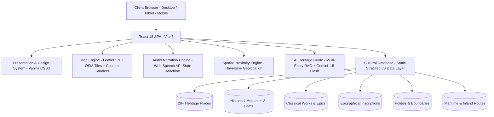
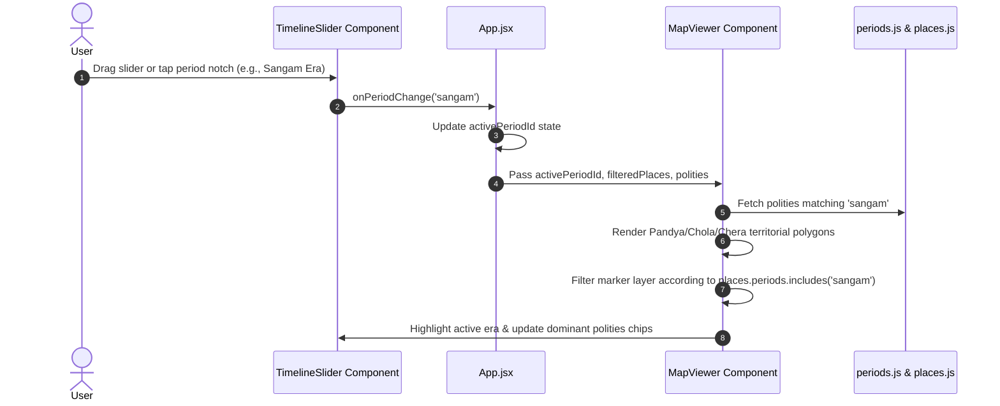
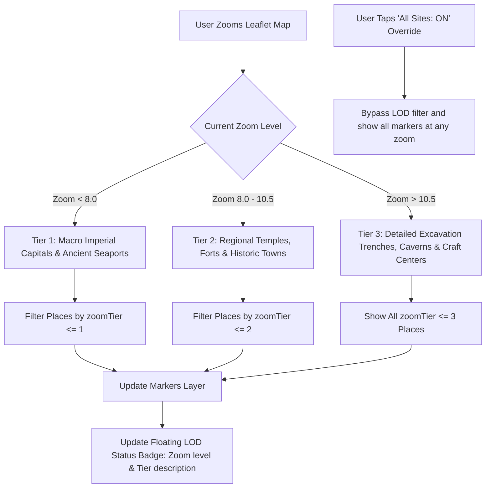
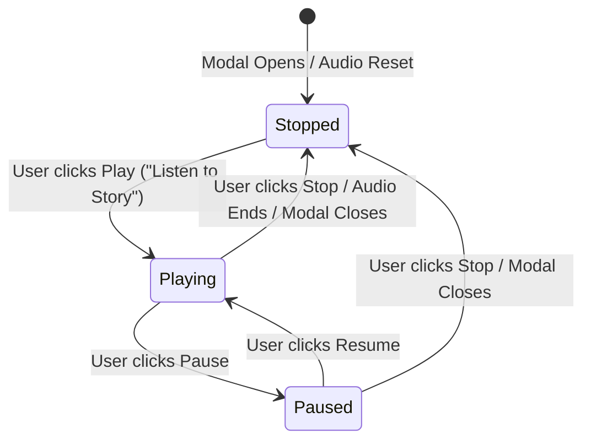

# GeoThamizh (புவியியல் தமிழ்): End-to-End Project Documentation

> **"Rooted in Time. Alive in Stories."**  
> *A Stratified, Source-Grounded Cultural Atlas of Tamil Heritage Across Time & Geography.*

---

## 1. Executive Summary & Vision

**GeoThamizh** is a web-based, interactive historical cartography and cultural stratigraphy platform dedicated to Tamil heritage. Rather than presenting monuments and ancient cities as static points on a modern satellite map, GeoThamizh maps the **spatial and temporal evolution** of Tamilakam from pre-Sangam antiquity (~1000 BCE) through the Sangam, Post-Sangam, Medieval Imperial, and Later Vijayanagara/Colonial eras into the present day.

### Core Pillars
1. **Stratigraphic Mapping (Then vs. Now)**: Every site reflects multiple historical layers—its ancient classical name, presiding polities, epigraphical records, architectural modifications, and present reality.
2. **Epigraphical & Archaeological Grounding**: Rejects speculative or pseudo-historical chronologies. Every date, inscription, and dynasty is cited from authoritative archaeological corpora (Archaeological Survey of India - ASI, Tamil Nadu State Department of Archaeology - TNSDA, Central Institute of Classical Tamil - CICT, and the international DHARMA project).
3. **Zoom-Based Level of Detail (LOD) & Decluttering**: Dynamic spatial filtering ensures that macro views highlight imperial capitals and international emporiums, regional zooms reveal temple cities and forts, and micro zooms reveal specific excavation trenches and rock caverns.
4. **Spatial Biographies & Classical Literature Integration**: Connects historical monarchs, poets, and scholars directly to monuments, and links classical anthologies (*Ettuthogai*, *Pattuppattu*, *Silappadikaram*) to real geographic coordinates.
5. **Multi-Modal Storytelling & Accessibility**: High-quality 30–60s spoken voice narration with dedicated Play, Pause, Resume, and Stop controls, documentary visual archives, living culture (GI-tagged crafts, culinary heritage), and a source-grounded "Ask the Map" AI Heritage Guide.
6. **Mobile-First Responsive Design**: Decoupled viewport containers, native mobile bottom sheets with drag handles, horizontal carousels, and collapsible search/timeline overlays.

---

## 2. Technology Stack & Architectural Overview



### 2.1 Core Framework & Tooling
* **Frontend Framework**: React 18 (Functional components, hooks: `useState`, `useEffect`, `useMemo`, `useRef`).
* **Build System & Dev Server**: Vite 6 (ultra-fast Hot Module Replacement, Rollup production bundler producing minified chunks).
* **Styling & Design System**: 100% Vanilla CSS3 (Custom CSS Custom Properties, antique atlas parchment theme, dark mode glassmorphism, responsive CSS Grid and Flexbox). No heavy third-party UI libraries like Tailwind or Bootstrap.
* **Iconography**: `lucide-react` (Lightweight, tree-shakeable SVG icons).
* **Package Manager**: npm.

### 2.2 Cartography & Geospatial Engine
* **Map Framework**: Leaflet 1.9.4 (`leaflet` npm package).
* **Base Map Tiles**: OpenStreetMap Standard Raster Tiles (`https://{s}.tile.openstreetmap.org/{z}/{x}/{y}.png`).
* **Antique Atlas Tile Shader**: Custom CSS post-processing pipeline applied directly to `.leaflet-tile-pane`:
  ```css
  filter: sepia(0.55) brightness(0.88) contrast(1.15) hue-rotate(-12deg) saturate(1.2);
  ```
  Transforms modern tiles into a warm, antique parchment aesthetic while preserving street and topography legibility.
* **Vector Layers**:
  * `L.geoJSON` & `L.polygon` for dynastic spheres of influence (Cholas, Pandyas, Cheras, Pallavas, Vijayanagara).
  * `L.polyline` with dashed animations for maritime monsoon routes and inland trade highways.
  * `L.circle` and `L.divIcon` with animated radar ripples for live GPS accuracy radii.
  * Custom teardrop SVG pins with period-themed category badges.

### 2.3 Audio & Voice Narration
* **Engine**: Browser-native Web Speech API (`window.speechSynthesis`, `SpeechSynthesisUtterance`).
* **State Machine**: Full lifecycle tracking: `Stopped` $\rightarrow$ `Playing` $\rightarrow$ `Paused` $\rightarrow$ `Resumed` $\rightarrow$ `Stopped`.
* **Voice Selection Algorithm**: Automatically scans available browser voices, preferring native Tamil voices (`ta-IN`, `ta-LK`) when Tamil text or script is detected, falling back to clear English voices.
* **Equalizer Visualizer**: CSS keyframe multi-bar soundwave animation oscillating in real-time during playback and freezing on pause.
* **Unmount Safety**: Guaranteed cleanup hook cancels any running audio immediately upon drawer, modal, or tab close.

### 2.4 Geolocation & Reverse Geocoding
* **Hardware API**: HTML5 `navigator.geolocation.getCurrentPosition` with `enableHighAccuracy: true`.
* **Spatial Distance Formula**: Haversine equation implemented in pure JavaScript to calculate geodesic distance in kilometers between the user's live coordinates and all 28+ heritage sites.
* **Reverse Geocoder**: OpenStreetMap Nominatim API with a 3000ms timeout controller and proximity fallback, resolving latitude/longitude to suburb, village, district, and state.

### 2.5 Multi-Entity RAG AI Engine
* **Grounding Layer**: In-memory multi-entity indexing over Places, Historical People, Literary Works, and Inscriptions.
* **Deterministic Synthesis**: Evaluates keyword, polity, and geographical intent to construct source-cited historical answers.
* **Interactive "Ask the Map" Actionable Badges**: Regex parses site names within the generated answer and renders interactive buttons (`"📍 Show on Map"`) that fly the Leaflet map directly to the cited monuments.
* **Live Generative AI Integration**: Optional input field for user's Google Gemini API key (`gemini-1.5-flash`). When provided, it crafts a grounded system prompt containing retrieved epigraphical context and fetches live multi-paragraph synthesis from Google Generative AI endpoints.

---

## 3. End-to-End System Workflows & User Journeys

### 3.1 The Time-Travel Exploration Workflow


1. The user navigates to the bottom timeline card.
2. The user drags the thumb or taps any era notch (Pre-Sangam, Sangam, Post-Sangam, Medieval Imperial, Later/Colonial, Today).
3. The platform re-filters the marker layer, showing only sites active in that historical era.
4. Leaflet draws the dynamic dynastic polygons and monsoon trade routes belonging to that period.
5. Clicking **Auto Time-Travel** begins an animated slideshow advancing through history every 3.8 seconds.

---

### 3.2 The Live GPS Stratigraphy Workflow ("What Happened Where I Stand?")
```mermaid
sequenceDiagram
    autonumber
    actor User
    participant FAB as GPS Locate Button
    participant App as App.jsx
    participant API as OSM Nominatim API
    participant Modal as PlaceConnectedHistoryModal

    User->>FAB: Click Live GPS Button (Floating or Menu)
    FAB->>App: onDetectLocation()
    App->>App: Request navigator.geolocation (High Accuracy)
    User->>App: Allow Location Permission
    App->>API: Reverse Geocode (lat, lon) with 3s timeout
    API-->>App: Return Village / Suburb / District name
    App->>App: Haversine distance to 28+ sites; identify nearest site
    App->>Modal: Open Connected History with isUserCurrentLocation=true
    Modal->>User: Display Regional Heritage Stratigraphy, Proximity Alert & Nearest Sites Carousel
```

1. User clicks the GPS Crosshair FAB in the bottom right or selects **📍 My Heritage Stratigraphy** in the navigation menu.
2. The browser requests geolocation. Once granted, coordinates are processed with the Haversine formula against all heritage coordinates.
3. If within 4 km of a monument, the monument's stratigraphy opens directly.
4. If standing in a modern residential or commercial area without a direct monument (e.g., modern Chennai, Madurai suburbs), a **Regional Heritage Proximity Alert** is shown, explaining the historical polity sphere and displaying a carousel of the closest heritage sites to visit.

---

### 3.3 Section 26 Zoom-Based Level of Detail (LOD) Workflow


1. When viewing the whole state of Tamil Nadu (Macro view), markers are decluttered to show only critical capitals (e.g., Thanjavur, Madurai, Uraiyur, Poompuhar).
2. As the user zooms in to district level, regional forts, coastal centers, and temples appear.
3. Deep zooming reveals specific excavation trenches (e.g., Keeladi, Adichanallur, Mayiladumparai) and rock caverns.
4. The user can override smart decluttering anytime using the floating LOD toggle button.

---

### 3.4 Voice Storytelling Narration Workflow


1. In either the Place Details Drawer or Connected History Modal, the user sees the **Voice Story Narration Bar**.
2. Clicking **Play** starts source-grounded narration.
3. The Play button dynamically turns into an amber **Pause** button, soundwave bars animate, and a red **Stop** button appears.
4. Clicking **Pause** halts narration mid-sentence; the button turns into a green **Resume** button, soundwaves freeze, and an amber `"PAUSED"` badge is displayed.
5. Clicking **Resume** continues narration from the exact paused syllable.
6. Clicking **Stop** or closing the modal immediately cancels speech and resets the button state.
7. Users can cycle through `0.8x`, `1.0x`, and `1.2x` narration speeds.

---

## 4. Complete Feature Catalog

### 4.1 Global Navigation Bar & Mobile Drawer (`Navbar.jsx`)
* **Antique Branding**: Displays the Tamil grapheme **த** inside an embossed circular seal with the golden title **GeoThamizh** and subtitle *"Stratified Tamil Cultural Atlas"*.
* **Desktop Navigation Links**:
  * 👑 **People**: Opens the Spatial Biographies Explorer.
  * 📜 **Literature**: Opens Classical Literature & Works Explorer.
  * 📖 **Stories**: Opens Curated Story Trails (Silappadikaram route, etc.).
  * 🍲 **Culture**: Opens Living Culture, GI Crafts, and Culinary Heritage.
  * 🕸️ **Knowledge Graph**: Opens Time-Aware Semantic Network.
* **Ask AI Guide Trigger**: Pulsing golden button invoking the interactive RAG AI drawer.
* **Global Language Switcher**: 5-language selector supporting:
  * `en` — English
  * `ta` — தமிழ் (Tamil)
  * `de` — Deutsch (German)
  * `fr` — Français (French)
  * `ja` — 日本語 (Japanese)
* **Mobile Hamburger Menu**:
  * Accessible on screens $\le$ 768px.
  * Backed by a blurred glass backdrop (`.mobile-nav-backdrop`).
  * Features quick buttons for all 5 explorers, GPS Location Stratigraphy, and a touch-friendly language grid.

---

### 4.2 Interactive Map Canvas & Shaders (`MapViewer.jsx`)
* **Full-Screen Responsive Viewport**: Contained within `<main className="map-viewport-wrapper">` ensuring zero overlap with the header.
* **Parchment Shader**: Custom CSS filter simulating 17th-century cartographic paper.
* **Period Boundary Polygons**:
  * Chola Realm (Tiger banner / Crimson-Gold polygon).
  * Pandya Realm (Twin Carp banner / Deep Amber polygon).
  * Chera Realm (Bow & Arrow banner / Forest Emerald polygon).
  * Pallava Realm (Nandi banner / Indigo polygon).
  * Vijayanagara Realm (Varaha banner / Bronze polygon).
* **Maritime Monsoon & Silk Routes**:
  * Southwest & Northeast monsoon maritime tracks crossing the Indian Ocean and Bay of Bengal.
  * Red dashed lines indicating Indo-Roman spice and textile corridors connecting Muziris, Arikamedu, and Alagankulam to Alexandria and Rome.
* **Interactive Map Markers**:
  * Teardrop SVG pins with period icons (temple gopuram, ancient fortress, excavation trowel, craft anvil, spice vessel).
  * Hover tooltip showing English and Tamil names.
  * Click handler opening complete connected history.

---

### 4.3 Search, Filter & City Directory Panel (`SearchFilterPanel.jsx`)
* **Real-Time Instant Search**: Filters across 28+ sites by English name, Tamil name, classical/historical name, district, or category.
* **Horizontal Category Strip**:
  * All Sites
  * Temples & Sacred Architecture
  * Ancient Cities & Capitals
  * Archaeological Excavations
  * Forts & Monuments
  * Classical Crafts & Metallurgy
  * Culinary & Living Culture
* **Historical Cities & Sites Directory**:
  * Collapsible list displaying site name, district, Tamil script, classical identity, and category pill.
  * Clicking any item flies the map to that site and opens its history.
* **Mobile-Compact State**:
  * On mobile screens, automatically starts in a sleek, compact single-line search bar (~46px).
  * Features a **Sliders Toggle Button** with site count badge.
  * Tapping the toggle button or typing into the search input expands the category chips and directory smoothly with CSS slide-down animation.

---

### 4.4 Unified Timeline Scrubber (`TimelineSlider.jsx`)
* **6 Chronological Eras**:
  1. **Present Reality (Today)**: 2026 CE modern geography and administrative districts.
  2. **Later Dynasties & Colonial Era (1336 – 1947 CE)**: Vijayanagara, Nayakas, Marathas, British Raj.
  3. **Medieval Imperial Era (850 – 1336 CE)**: Imperial Cholas (Rajaraja I, Rajendra I), Later Pandyas.
  4. **Post-Sangam & Pallava Era (300 – 850 CE)**: Kalabhra interregnum, Pallavas of Kanchipuram, Early Pandyas.
  5. **Classical Sangam Era (300 BCE – 300 CE)**: Early Cholas, Early Pandyas, Cheras, Roman maritime trade.
  6. **Pre-Sangam / Iron Age Antiquity (~1000 – 300 BCE)**: Adichanallur, Mayiladumparai, early urn burials, Tamil-Brahmi roots.
* **Scrubbable Touch Slider**:
  * Custom styled thumb with 24px touch target.
  * Clickable era notches with indicator dots.
  * Dominant polities badge summary.
* **Mobile Mini Mode**:
  * Features a chevron toggle (`ChevronDown`/`ChevronUp`).
  * Minimizes to an unobtrusive 40px bottom bar displaying the active era title and Play button, leaving 95% of the mobile screen clear for map interaction.

---

### 4.5 Place Connected History Modal (`PlaceConnectedHistoryModal.jsx`)
* **Native Mobile Bottom Sheet**: On mobile devices, transitions into a bottom-docked modal with rounded top corners and a drag handle pill.
* **Navigation Tabs Strip**:
  * **Overview & Then vs. Now**: Side-by-side comparative cards contrasting historical significance against modern context.
  * **Old Names Chronology**: Epigraphical progression of how the site was recorded across centuries in Sangam poetry, copper plates, and colonial gazetteers.
  * **Polities & Dynasties**: Ruling dynasties, regnal years, and historical events.
  * **Epigraphy & Inscriptions**: ASI / TNSDA accession numbers, script type (Tamil-Brahmi, Vatteluttu, Grantha), ruling king, and translated summary.
  * **Architectural Stratigraphy**: Evolution of stone plinths, pillars, mandapams, and gopurams.
  * **Nearby Places (GPS Proximity)**: Dynamically rendered when triggered via GPS, suggesting the closest heritage destinations.
* **Voice Storytelling Player**: Complete audio narration controls (Play, Pause, Resume, Stop, speed cycling, and equalizer).
* **Documentary Media Section (Section 24)**: Verified visual survey videos and institutional attribution badges.

---

### 4.6 People of Tamilakam Explorer (`PeopleExplorerModal.jsx`)
* **Browse Classical Figures**: Monarchs, poets, scholars, and religious figures including *Rajaraja Chola I, Rajendra Chola I, Karikala Chola, Mahendravarman I, Rani Mangammal, Avvaiyar, Thiruvalluvar, Ilango Adigal, Kambar, Neduncheziyan*.
* **Filter by Category**: All, Monarchs, Poets, Scholars.
* **Instant Keyword Filter**: Search by English or Tamil name.
* **Mobile Horizontal Carousel**: Figures are presented in a flickable horizontal card strip at the top, allowing the biography, quotes, and monument jump links to scroll freely below.
* **Spatial Jump Anchors**: Clicking an associated monument flies the map to that site, highlights its marker, and dismisses the explorer.

---

### 4.7 Classical Tamil Literature Explorer (`WorksExplorerModal.jsx`)
* **Browse Classical Corpus**: Anthologies and epics including *Tolkappiyam, Silappadikaram, Tirukkural, Purananuru, Pattinappalai, Manimekalai*.
* **Literary Excerpts**: Original classical Tamil stanzas accompanied by English translations.
* **Geographical Links**: Interactive buttons connecting literary settings (e.g., Poompuhar, Madurai, Vanchi, Kaveripoompattinam) directly to the map canvas.
* **Mobile Responsive**: Uses the same horizontal carousel + single vertical detail pane architecture for smooth touch scrolling.

---

### 4.8 Source-Grounded AI Heritage Guide & "Ask the Map" (`AIGuideDrawer.jsx`)
* **Deterministic Grounding**: Searches local indexes for Places, People, Works, and Inscriptions to synthesize historically accurate responses.
* **Academic Citations**: Every answer references institutional sources (ASI, TNSDA, CICT, DHARMA).
* **Actionable "📍 Show on Map" Tags**: The assistant automatically embeds interactive buttons for every mentioned location. Clicking any tag flies the map to the monument.
* **Speech Synthesis for Answers**: Every generated response includes a voice playback button.
* **Optional Live Gemini API Key**: Users can optionally supply their personal Google Gemini API key (`gemini-1.5-flash`) for live generative synthesis grounded in epigraphical context.

---

### 4.9 Curated Journeys & Story Trails (`StoriesDrawer.jsx`)
* **Narrative Journeys**: Step-by-step spatial walkthroughs:
  * *Kannagi’s Journey (Silappadikaram)*: From Poompuhar through Uraiyur and Kodumanal to Madurai and the Western Ghats.
  * *Chola Imperial Naval Campaign*: From Thanjavur and Gangaikonda Cholapuram to Nagapattinam, Kadaram (Kedah), and Srivijaya.
* **Step-by-Step Waypoint Controls**: Previous, Next, and Auto-fly controls centering the map on each narrative milestone.

---

### 4.10 Living Culture & GI Crafts (`LivingCultureSection.jsx`)
* **Three Dedicated Culture Tabs**:
  1. **Culinary Heritage**: Chettinad spice trade heritage, Madurai Jigarthanda, Tirunelveli Halwa, Ambur Biryani.
  2. **Crafts & Arts (GI Tagged)**: Swamimalai lost-wax bronze casting, Thanjavur gold foil paintings, Kanchipuram silk weaving, Athangudi handmade tiles, Nachiarkoil brass lamps.
  3. **Sacred Festivals**: Madurai Chithirai festival, Chidambaram Natyanjali, Tiruvannamalai Karthigai Deepam, Thanjavur Brahan-Natyanjali.
* Includes direct "View on Map" links to each craft or culinary capital.

---

### 4.11 Time-Aware Semantic Knowledge Graph (`KnowledgeGraphModal.jsx`)
* **Semantic Network**: Maps relations across nodes:
  * `Place` ↔ `Person` (e.g., *Thanjavur* was commissioned by *Rajaraja Chola I*).
  * `Person` ↔ `Literature` (e.g., *Ilango Adigal* authored *Silappadikaram*).
  * `Place` ↔ `Literature` (e.g., *Poompuhar* is the setting of *Silappadikaram*).
  * `Place` ↔ `Inscription` (e.g., *Uttiramerur* houses the *Kudavolai Democratic Election Inscription*).
* **Filter by Entity Type**: Filter nodes by Place, Person, Literature, or Inscription.
* **Interactive Node Inspector**: Select any node to view all incoming and outgoing historical connections with one-tap map jumps.

---

## 5. Mobile & Tablet Responsive Architecture

| Component | Desktop Behavior (> 768px) | Mobile Behavior ($\le$ 768px) |
| :--- | :--- | :--- |
| **Viewport Wrapper** | `.map-viewport-wrapper` flex child below 64px navbar | Adapts height to `calc(100vh - 56px)` |
| **Top Navbar** | Full horizontal links + language select + AI button | Collapses links to hamburger menu; tagline hidden; compact controls |
| **Search Filter Panel** | 380px floating card at top-left | Compact 46px search bar; expands with Sliders button; max width `calc(100vw - 1rem)` |
| **City Directory** | Scrollable 250px vertical list | Auto-collapsed by default; 130px max-height when expanded |
| **Timeline Scrubber** | 780px wide centered floating card with era tick labels | Full width `calc(100vw - 1rem)`; tick notches hidden; collapsible to 40px mini bar |
| **Connected History Modal** | Centered floating modal box (780px) | Native bottom sheet (`border-radius: 20px 20px 0 0`) with drag handle; 88vh max-height |
| **People & Works Explorers** | 2-column side-by-side layout (320px list + detail pane) | Horizontal flickable carousel at top (~68px) + single vertical scroll pane for details |
| **Knowledge Graph Modal** | 860px wide 2-column split view | Full-screen bottom sheet with stacked single-column layout |
| **Drawers (AI, Stories, Details)** | 520px side drawer sliding from right | 100vw full-screen sliding sheet |
| **Google Maps Locate FAB** | Bottom: 8.5rem, Right: 1.25rem | Bottom: 5.6rem, Right: 0.75rem (never collides with timeline) |
| **Zoom LOD Badge** | Top: 16px, Right: 16px | Floats gracefully above the timeline card at bottom-left |

---

## 6. Data Models & Epigraphical Grounding

### 6.1 Heritage Place Schema (`src/data/places.js`)
```javascript
{
  id: "thanjavur",
  name: "Thanjavur",
  tamilName: "தஞ்சாவூர்",
  classicalName: "Tanjapuri / Thanjai",
  district: "Thanjavur",
  lat: 10.7828,
  lng: 79.1318,
  categories: ["temples", "monuments", "ancient_cities"],
  zoomTier: 1, // Section 26: 1=Macro capital, 2=Regional town, 3=Excavation trench
  periods: ["today", "later", "medieval"],
  image: "https://images.unsplash.com/...",
  imageAttribution: "Archaeological Survey of India (ASI)",
  videoUrl: "https://www.youtube.com/embed/...",
  audioNarration: "Thanjavur, ancient Tanjapuri, was the imperial capital...",
  whyItMatters: "Epicenter of medieval Chola imperial architecture...",
  shortDescription: "Home of the Great Living Chola Temples...",
  historicalNamesChronology: [
    { period: "Sangam Era", name: "Thanjai", source: "Sangam Anthologies" },
    { period: "Medieval Chola", name: "Tanjapuri", source: "Brihadisvara Inscriptions" },
    { period: "Nayaka / Maratha", name: "Tanjore", source: "Saraswathi Mahal Records" }
  ],
  polities: [
    { name: "Imperial Cholas", era: "850 – 1279 CE", role: "Imperial Capital" },
    { name: "Thanjavur Nayakas", era: "1532 – 1673 CE", role: "Artistic Renaissance" },
    { name: "Thanjavur Marathas", era: "1674 – 1855 CE", role: "Literary & Musical Patronage" }
  ],
  inscriptions: [
    {
      id: "than-ins-01",
      title: "Rajaraja I Foundation Epigraph",
      regnalYear: "25th Regnal Year (1010 CE)",
      script: "Tamil & Grantha",
      summary: "Documents complete land grants, bronze dedications and names of 400 temple dancers."
    }
  ],
  stratigraphy: {
    then: "Imperial administrative and ritual center of the Chola empire.",
    now: "UNESCO World Heritage cultural capital and agricultural delta hub."
  }
}
```

### 6.2 Complete Sites Inventory (28+ Sites)
1. **Adichanallur** (Iron Age urn burials, 900 BCE)
2. **Mayiladumparai** (Earliest Iron Age metallurgy, 2172 BCE)
3. **Kodumanal** (Wootz steel, quartz & gemstone beads, Tamil-Brahmi graffiti)
4. **Keeladi** (Vaigai river valley urban Sangam civilization, 6th century BCE)
5. **Korkai** (Pandyan Sangam capital & pearl fishery port)
6. **Alagankulam** (Pandyan seaport on Palk Strait with Roman coin hoards)
7. **Poompuhar (Kaveripoompattinam)** (Chola port emporium & Silappadikaram setting)
8. **Uraiyur** (Early Sangam Chola capital & Roman muslin trade center)
9. **Arikamedu** (Indo-Roman trading post, amphorae & rouletted ware)
10. **Madurai** (Ancient Pandyan capital, Sangam academies, Meenakshi temple)
11. **Thanjavur** (Brihadisvara temple, Chola imperial capital, Saraswathi Mahal)
12. **Gangaikonda Cholapuram** (Rajendra I capital celebrating the Ganges conquest)
13. **Kanchipuram** (Pallava capital, city of thousand temples, silk center)
14. **Mamallapuram** (UNESCO rock-cut rathas, Shore Temple & maritime port)
15. **Uttiramerur** (Kudavolai democratic election inscription of 920 CE)
16. **Chidambaram** (Nataraja temple, Chola coronation site, cosmic dance tradition)
17. **Tiruvannamalai** (Annamalaiyar Agni lingam temple, 217-ft Rajagopuram)
18. **Kumbakonam** (Mahamaham sacred tank, brass craft, temple town)
19. **Nagapattinam** (Chola naval base & Chudamani Buddhist Vihara)
20. **Thirumayam** (Pandyan-Pallava rock fort & rock-cut cave temples)
21. **Sittanavasal** (Jain cave hermitage, 2nd century BCE Tamil-Brahmi & frescoes)
22. **Swamimalai** (Chola lost-wax bronze casting tradition, GI tagged)
23. **Chettinad** (Palatial merchant mansions, Athangudi handmade tiles)
24. **Tirunelveli** (Nellaiappar temple, resonant musical stone pillars)
25. **Kanyakumari** (Ocean confluence, 133-ft Thiruvalluvar statue, Ay kingdom)
26. **Karur (Vanji)** (Early Chera inland capital, Roman coin hoards & ringwells)
27. **Vembakottai** (Vaippar basin terracotta and microlithic excavation)
28. **Pudukkottai** (Narttamalai early Chola stone shrines & Megalithic dolmens)

---

## 7. Directory Structure & File Map

```
d:/New folder geo tamizh/
├── index.html                           # Entry HTML with Google Fonts & responsive viewport meta
├── package.json                         # Project manifest (React 18, Vite 6, Leaflet, Lucide)
├── vite.config.js                       # Vite configuration with React plugin
├── src/
│   ├── main.jsx                         # React DOM bootstrap entrypoint
│   ├── index.css                        # Global CSS design system, parchment theme & media queries
│   ├── App.jsx                          # Main application controller & state orchestrator
│   ├── components/
│   │   ├── Navbar.jsx                   # Top navigation bar & mobile dropdown drawer
│   │   ├── MapViewer.jsx                # Leaflet map host, tile shaders, vector layers & LOD badge
│   │   ├── SearchFilterPanel.jsx        # Floating collapsible search bar & city directory
│   │   ├── TimelineSlider.jsx           # Unified scrubbable timeline slider with auto-play
│   │   ├── PlaceDetailModal.jsx         # Quick place detail drawer with voice storytelling
│   │   ├── PlaceConnectedHistoryModal.jsx# Complete multi-tab connected stratigraphy bottom sheet
│   │   ├── AIGuideDrawer.jsx            # Multi-entity RAG AI Guide ("Ask the Map")
│   │   ├── StoriesDrawer.jsx            # Curated journey trails (Kannagi, Chola naval)
│   │   ├── LivingCultureSection.jsx     # Food, GI crafts & festivals drawer
│   │   ├── KnowledgeGraphModal.jsx      # Time-aware semantic graph modal
│   │   ├── PeopleExplorerModal.jsx      # Spatial biographies explorer (monarchs & poets)
│   │   └── WorksExplorerModal.jsx       # Classical literature & verses explorer
│   └── data/
│       ├── places.js                    # 28+ stratified heritage sites with epigraphy & LOD tiers
│       ├── periods.js                   # 6 chronological eras & timeline metadata
│       ├── historicalPolities.js        # Dynastic boundary coordinates and heraldic data
│       ├── tradeRoutes.js               # Maritime monsoon routes & inland trade corridors
│       ├── sources.js                   # Academic citation registry (ASI, TNSDA, CICT, DHARMA)
│       ├── people.js                    # Monarchs, poets, scholars with spatial connections
│       ├── works.js                     # Classical works with stanzas, translations & map links
│       ├── inscriptions.js              # Epigraphical records with script & regnal years
│       ├── stories.js                   # Curated spatial story stops
│       ├── livingCulture.js             # Culinary heritage, GI crafts & festival schedules
│       ├── knowledgeGraph.js            # Node and edge relations across entities
│       └── translations.js              # 5-language localization dictionaries (EN, TA, DE, FR, JA)
```

---

## 8. Installation, Development & Deployment

### 8.1 Prerequisites
* **Node.js**: Version 18.0.0 or higher.
* **npm**: Version 9.0.0 or higher.

### 8.2 Installation
```bash
# Clone or navigate to the repository directory
cd "d:/New folder geo tamizh"

# Install all dependencies
npm install
```

### 8.3 Running the Local Development Server
```bash
npm run dev
```
* Vite will launch locally (typically at `http://localhost:5173/` or `http://localhost:5174/`).
* Hot Module Replacement (HMR) is active; edits to JSX, CSS, or data files update instantly without full page reloads.

### 8.4 Production Build & Optimization
```bash
npm run build
```
* Builds the project into the `dist/` directory.
* Automatically compiles, minifies, and tree-shakes modules.
* Asset outputs:
  * `dist/index.html` (~1.4 kB)
  * `dist/assets/index-[hash].css` (~36 kB minified / ~7 kB gzip)
  * `dist/assets/index-[hash].js` (~600 kB minified / ~180 kB gzip)

### 8.5 Previewing the Production Bundle Locally
```bash
npm run preview
```

---

## 9. Epigraphical Integrity & Academic Rigor

GeoThamizh adheres strictly to the following academic standards:
* **Zero Speculation Policy**: Dates adhere strictly to peer-reviewed epigraphical publications (e.g., *Epigraphia Indica*, *South Indian Inscriptions*, and reports by the Tamil Nadu State Department of Archaeology).
* **Epigraphical Transliteration**: Inscription titles list the discovered script (Tamil-Brahmi, Vatteluttu, or Grantha), regnal year, and donor record.
* **Preservation of Cultural Script**: Tamil script is presented alongside English transliterations and international translations across every component.
* **Source Citations**: All stratigraphic layers trace back to primary documentation archived in the academic sources registry.

---

*GeoThamizh — Built with reverence for classical Tamil literature, epigraphy, and cultural geography.*
