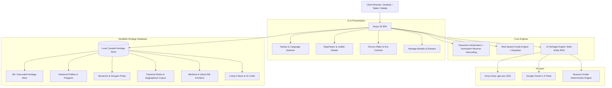

# GeoThamizh (புவியியல் தமிழ்)

<div align="center">

> *"Rooted in Time. Alive in Stories."*  
> **A Stratified, Source-Grounded Cultural Atlas & Historical Cartography Platform for Tamil Heritage Across 3,000+ Years.**

[](https://react.dev/)
[](https://vitejs.dev/)
[](https://leafletjs.com/)
[](https://developer.mozilla.org/en-US/docs/Web/API/Web_Speech_API)
[](https://developer.mozilla.org/en-US/docs/Web/CSS)
[](https://groq.com/)
[](LICENSE)

[Explore Features](#-key-features) •
[Architecture](#-architecture--data-flow) •
[Quickstart](#-quickstart--installation) •
[Project Structure](#-project-structure) •
[Data Sources](#-epigraphical--archaeological-sources)

---

</div>

## 📖 Overview

**GeoThamizh** is an interactive, source-grounded historical cartography and cultural stratigraphy platform dedicated to the heritage of **Tamilakam** and the global Tamil diaspora. 

Rather than plotting ancient monuments as static markers on modern satellite maps, GeoThamizh reveals the **spatial and temporal layers** of Tamil civilization from **Pre-Sangam antiquity (~1000 BCE)** through the **Sangam**, **Post-Sangam**, **Medieval Imperial**, and **Later Vijayanagara/Colonial** eras into the **Present Day**.

Every monument, trade corridor, and maritime route is anchored to verified epigraphical records, archaeological excavations, and classical Sangam anthologies.

---

## ✨ Key Features

### 🗺️ 1. Antique Cartography & Custom Shaders
- **Antique Parchment Tile Shader**: Custom post-processing CSS filter applied over OpenStreetMap raster tiles, evoking 17th-century cartographic paper while keeping street details readable.
- **Dynastic Spheres of Influence**: Dynamic vector polygons depicting historical territorial boundaries:
  - 🐯 **Chola Realm** (Tiger Banner · Crimson-Gold)
  - 🐟 **Pandya Realm** (Twin Carp Banner · Deep Amber)
  - 🏹 **Chera Realm** (Bow & Arrow Banner · Forest Emerald)
  - 🐂 **Pallava Realm** (Nandi Banner · Indigo)
  - 🐗 **Vijayanagara Realm** (Varaha Banner · Bronze)
- **Monsoon & Silk Corridors**: Animated maritime tracks crossing the Indian Ocean and Bay of Bengal alongside Indo-Roman overland trade corridors (connecting Muziris, Arikamedu, and Alagankulam to Alexandria and Rome).

### ⏳ 2. Time-Travel Chrono-Slider & Auto-Play
- **6 Historical Eras**: Smoothly jump across pre-Sangam antiquity, Sangam age, Post-Sangam era, Medieval Golden Age, Colonial epoch, and modern Tamil Nadu.
- **Auto Time-Travel**: Automated historical slideshow mode advancing eras sequentially every 3.8 seconds with synchronized boundary animations and marker transitions.

### 📍 3. Live GPS Stratigraphy ("What Happened Where I Stand?")
- **Hardware Geolocation**: Reads user coordinates with high-accuracy HTML5 Geolocation.
- **Haversine Proximity Matcher**: Computes real-time distance to 28+ heritage sites and historical capitals.
- **Reverse Geocoding**: Resolves nearby coordinates via OpenStreetMap Nominatim with a 3-second resilient timeout.
- **Contextual Proximity Alerts**: Even when standing in modern residential districts, GeoThamizh identifies the ancient polity sphere and recommends nearest heritage landmarks.

### 🪟 4. Split-Screen Map Slider (Then vs. Now)
- Interactive side-by-side split screen with an draggable divider.
- Compare ancient dynastic territories and river courses against modern infrastructure, district boundaries, and satellite views.

### 🔍 5. Level of Detail (LOD) & Decluttering
- **Macro Zoom (< 8.0)**: Imperial capitals (Thanjavur, Madurai, Uraiyur, Poompuhar) and prime maritime emporiums.
- **Regional Zoom (8.0 – 10.5)**: Historic temple cities, hillforts, and defense citadels.
- **Micro Zoom (> 10.5)**: Excavation trenches (Keeladi, Adichanallur, Mayiladumparai) and rock-cut caverns.
- Includes a manual **LOD Override Toggle** for uninterrupted site visibility.

### 🤖 6. AI Heritage Guide (Multi-Entity RAG)
- Powered by high-speed **Groq (gpt-oss-120b / LLaMA)** and **Google Gemini 1.5 Flash**.
- **Multi-Entity In-Memory RAG**: Indexes monuments, monarchs, classical anthologies, and epigraphical corpus.
- **"📍 Show on Map" Action Badges**: Dynamically identifies places within AI answers and renders interactive jump-to-map buttons.
- **Domain Guard & Fallback**: Rebuffs out-of-domain queries and provides curated museum-grade answers even without an API key or internet connectivity.

### 🎙️ 7. Spoken Voice Narration (Web Speech API)
- 30–60 second immersive voice tours for every monument and historical narrative.
- **Robust State Machine**: Native support for **Play**, **Pause**, **Resume**, and **Stop**.
- **Locale Voice Sensing**: Automatically detects native Tamil voices (`ta-IN`, `ta-LK`) for Tamil script and clear English voices for multilingual descriptions.
- **Live Soundwave Equalizer**: Dynamic oscillating visualizer in sync with audio state.
- **Multi-Speed Playback**: Seamlessly toggle between `0.8x`, `1.0x`, and `1.2x`.

### 📚 8. Spatial Biographies & Classical Literature
- **People Explorer**: Detailed timelines and territorial domains of emperors, warrior queens, and Sangam poets (Rajaraja I, Avvaiyar, Kapilar, Thiruvalluvar, Mangammal).
- **Literature Explorer**: Direct spatial connections from texts like *Silappadikaram*, *Manimekalai*, *Tolkappiyam*, and *Purananuru* to geographic sites.

### 🧵 9. Living Culture & GI-Tagged Crafts
- Deep dives into living traditions: Thanjavur Art Plates, Swamimalai Bronze casting, Kanchipuram Silk weaving, Pattamadai mats, Chettinad architecture, and ancient culinary traditions.

### 🕸️ 10. Interactive Knowledge Graph
- Time-aware node-link semantic network connecting monarchs, dynasties, battles, architectural monuments, and inscriptions.

### 🧳 11. Heritage Chronicles & Tourist Safety (SOS)
- **Curated Itineraries**: Day-by-day expedition plans (Chola Heartland Circuit, Sangam Maritime Trail, Pandya Rock-Cut Journey).
- **Today in History**: Daily chronicle engine celebrating historical milestones, epigraphical discoveries, and cultural anniversaries.
- **Tourist SOS Hub**: Emergency contacts, tourist police, medical aid, 24/7 National Tourist Helpline (1363), and embassy directories.
- **Social Share Cards**: Export aesthetic, museum-branded shareable graphic cards with coordinates, quotes, and historical milestones.

### 🌐 12. Multilingual Support
Full UI and descriptive content localized in 5 languages:
- 🇬🇧 English (`en`)
- 🇮🇳 தமிழ் (`ta`)
- 🇩🇪 Deutsch (`de`)
- 🇫🇷 Français (`fr`)
- 🇯🇵 日本語 (`ja`)

---

## 🏛️ Architecture & Data Flow



---

## 📂 Project Structure

```text
geo-tamizh/
├── public/                       # Static assets & favicon
├── src/
│   ├── assets/                   # Vector graphics, banners & textures
│   ├── components/               # React components
│   │   ├── AIChatbot/            # Production AI Heritage Guide
│   │   │   ├── AIChatbotDrawer.jsx
│   │   │   ├── AIChatbotFloatingButton.jsx
│   │   │   ├── AIChatbot.css
│   │   │   ├── groqHeritageEngine.js
│   │   │   ├── heritageScopeGuard.js
│   │   │   ├── heritageSchema.js
│   │   │   └── components/HeritageAnswer.jsx
│   │   ├── AudioHeritageGuideModal.jsx   # Dedicated spoken tour modal
│   │   ├── HeritageChroniclesModal.jsx   # Hub: Itineraries & Daily History
│   │   ├── ItineraryPlannerModal.jsx     # Curated heritage tour itineraries
│   │   ├── KnowledgeGraphModal.jsx       # Interactive semantic knowledge graph
│   │   ├── LivingCultureSection.jsx      # GI crafts, cuisine, and living arts
│   │   ├── LoginModal.jsx                # User profiles, preferences & bookmarks
│   │   ├── MapViewer.jsx                 # Leaflet map, vector polygons & routes
│   │   ├── Navbar.jsx                    # Header, quick explorers & language switch
│   │   ├── PeopleAndLiteratureModal.jsx  # Monarchs, poets & classical literature
│   │   ├── PlaceConnectedHistoryModal.jsx# Full site stratigraphy, timeline & audio
│   │   ├── SearchFilterPanel.jsx         # Search bar, category filters & site list
│   │   ├── SocialShareCardModal.jsx      # Exportable museum card generator
│   │   ├── SplitScreenMapSlider.jsx      # Then vs. Now comparison slider
│   │   ├── StoriesDrawer.jsx             # Story-driven narrative journeys
│   │   ├── TimelineSlider.jsx            # Chrono-slider & time-travel controls
│   │   ├── TodayInHistoryModal.jsx       # Daily historical events calendar
│   │   └── TouristSOSModal.jsx           # Emergency helpline & medical contacts
│   ├── data/                     # Stratified archaeological & cultural dataset
│   │   ├── audioTourScripts.js   # Spoken audio narrative scripts
│   │   ├── dailyHistory.js       # Curated daily events
│   │   ├── daily_events.json     # Comprehensive historical event records
│   │   ├── historicalPolities.js # GeoJSON-style polygons & dynastic boundaries
│   │   ├── inscriptions.js       # ASI/TNSDA epigraphical records & translations
│   │   ├── itineraries.js        # Curated heritage travel plans
│   │   ├── knowledgeGraph.js     # Nodes and edges for semantic graph
│   │   ├── livingCulture.js      # GI craft details, techniques & locations
│   │   ├── maritimeRoutes.js     # Monsoon navigation paths & coordinates
│   │   ├── people.js             # Historical monarchs, queens & Sangam poets
│   │   ├── periods.js            # Epoch boundaries & temporal definitions
│   │   ├── places.js             # 28+ stratified archaeological sites
│   │   ├── sources.js            # Primary archaeological & textual citations
│   │   ├── tradeRoutes.js        # Inland transit & merchant guild routes
│   │   ├── translations.js       # Localization dictionary (en, ta, de, fr, ja)
│   │   └── works.js              # Classical literary works & epics
│   ├── App.jsx                   # Main application orchestrator & state manager
│   ├── index.css                 # Vanilla CSS design system & parchment shaders
│   └── main.jsx                  # Application entry point
├── package.json                  # Dependencies and build scripts
├── vite.config.js                # Vite build and plugin configuration
└── README.md                     # Project documentation
```

---

## 🚀 Quickstart & Installation

### Prerequisites
- **Node.js**: v18.0.0 or higher
- **npm**: v9.0.0 or higher

### 1. Clone the Repository
```bash
git clone https://github.com/arvind-skg/geothamizh.git
cd geothamizh
```

### 2. Install Dependencies
```bash
npm install
```

### 3. Configure Environment Variables (Optional)
The platform runs completely out-of-the-box with offline fallback answers for the AI Guide. To enable live Generative AI queries, create a `.env` file in the root directory:

```env
# Groq Cloud API Key for ultra-fast LLaMA 3.3 / gpt-oss-120b inference
VITE_GROQ_API_KEY=gsk_your_groq_api_key_here

# Google Gemini API Key (optional alternate backend)
VITE_GEMINI_API_KEY=your_gemini_api_key_here
```

### 4. Run Development Server
```bash
npm run dev
```
Open your browser and navigate to `http://localhost:5173`.

### 5. Build for Production
```bash
npm run build
```
Preview the production build locally:
```bash
npm run preview
```

---

## 📜 Epigraphical & Archaeological Sources

GeoThamizh rejects speculative chronologies. Every date, inscription, and dynasty is sourced from reputable research bodies and peer-reviewed archaeological publications:

| Source Authority | Focus Area | Exemplar Sites in GeoThamizh |
| :--- | :--- | :--- |
| **ASI** (Archaeological Survey of India) | Monument architecture, structural conservation, excavations | Brihadisvara Temple, Mamallapuram, Gingee Fort |
| **TNSDA** (Tamil Nadu State Department of Archaeology) | Stratified carbon dating, Sangam urbanization, Tamil-Brahmi script | Keeladi, Mayiladumparai, Adichanallur, Korkai |
| **CICT** (Central Institute of Classical Tamil) | Sangam anthologies, geographical references, poetic geography | *Purananuru*, *Kuruntokai*, *Pattinappalai*, *Silappadikaram* |
| **DHARMA Project** (ERC / CNRS / EFEO) | South Asian epigraphy, Tamil and Sanskrit inscriptions | Uttiramerur Inscription, Velvikudi Copper Plates |
| **Epigraphia Indica** & **South Indian Inscriptions (SII)** | Official government epigraphical gazettes | Chola & Pandya royal land grants, maritime decrees |

---

## 🎨 Design System & Aesthetics

- **100% Vanilla CSS**: Crafted without utility frameworks (Tailwind/Bootstrap), prioritizing lightweight bundle sizes and high render performance.
- **Theme**: Antique parchment aesthetic blended with dark-mode glassmorphic cards (`rgba(22, 19, 15, 0.85)`).
- **Typography**: Clean modern type scales supporting both Latin and Tamil Unicode script blocks (`Cinzel`, `Outfit`, `Noto Sans Tamil`).
- **Responsive**: Mobile-first architecture with swipeable drawers, bottom-sheet overlays, and adaptive touch-target sizing.

---

## 🤝 Contributing

Contributions are welcome! Whether you are an archaeologist, epigraphist, software engineer, or translator:

1. **Fork the Repository**
2. **Create a Feature Branch**:
   ```bash
   git checkout -b feature/heritage-site-enrichment
   ```
3. **Commit your changes**:
   ```bash
   git commit -m "feat: add Sittanavasal rock-cut cave paintings & Jain beds"
   ```
4. **Push to the branch**:
   ```bash
   git push origin feature/heritage-site-enrichment
   ```
5. **Open a Pull Request** with proper epigraphical or literary citations.

---

## 📄 License

This project is licensed under the **MIT License** — see the [LICENSE](LICENSE) file for details.

---

<div align="center">

**GeoThamizh** — Preserving ancient memory through modern cartography.  
*Made with ❤️ for Tamil culture, history, and literature.*

</div>
